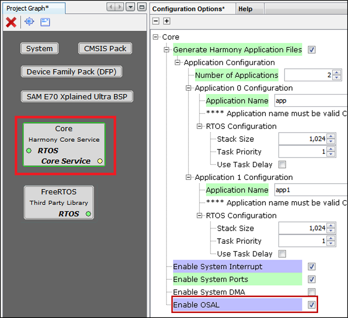

# Configuring the Library

The OSAL can be configured through the MHC. The following figure shows the MHC configuration window for configuring the

OSAL and a brief description of various configuration options.

The OSAL can be enabled by the user in two ways:

-   User can manually enable OSAL which is part of Harmony Core component.

-   OSAL will get auto enabled and set to "BareMetal" when Middleware or any Driver is instantiated. If any Third-Party Library i.e. RTOS is added then the respective OSAL Layer code will get generated.

    -   For instance if user instantiates FreeRTOS, then OSAL is set to **FreeRTOS** and **osal\_freertos.c** code will get generated during code generation.

**Parent topic:**[OSAL Library](GUID-8AEFE0B0-CE35-4F99-ACF4-7C8E10D3BBB6.md)

