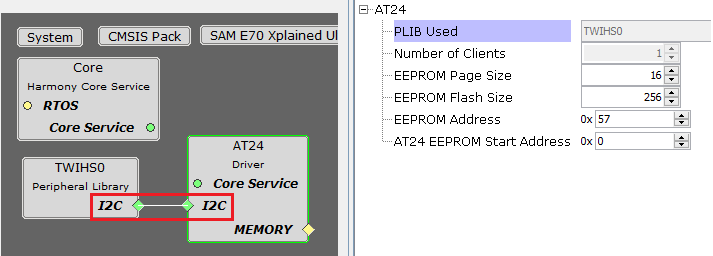

# Configuring The Library

The AT24 driver library should be configured through the MHC. The following figures show the MHC configuration window for the AT24 driver and brief description.

**AT24 Driver with SPI peripheral connected**

**Configuration Options**

-   **PLIB Used:**

    -   Specifies the Peripheral library connected

-   **Number Of Clients:**

    -   Indicates maximum number of clients

    -   Always set to one as it supports only a single client

-   **EEPROM Page Size:**

    -   Size of one page of EEPROM memory \(in bytes\)

-   **EEPROM Flash Size:**

    -   Total Size of the EEPROM memory \(in bytes\)

    -   Depending on the specified EEPROM Flash Size, the driver will generate the appropriate number of address bits \(8-bit, 16-bit or 24-bit\), thereby allowing it to communicate with EEPROM of different sizes in the AT24 family

-   **EEPROM Address:**

    -   The seventh bit of I2C slave address of the EEPROM

    -   This pin must be configured as GPIO output in "Pin Settings" configuration

-   **AT24 EEPROM Start Address:**

    -   Specifies the EEPROM memory start address to be used for Transfer operations

    -   The start address will be populated in the device geometry table DRV\_AT24\_GEOMETRY

**Parent topic:**[AT24 Driver](GUID-BA1691E2-6B02-4CCD-94F8-7936A71EC069.md)

