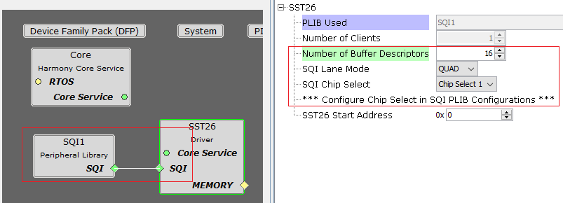
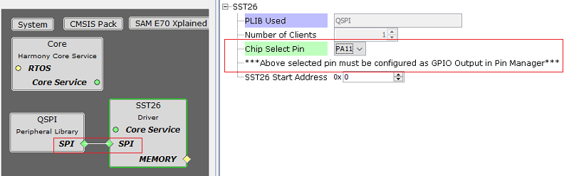
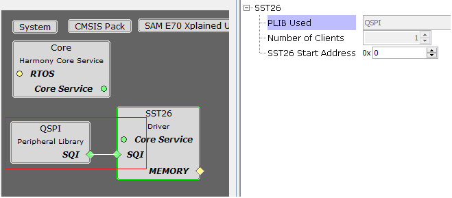
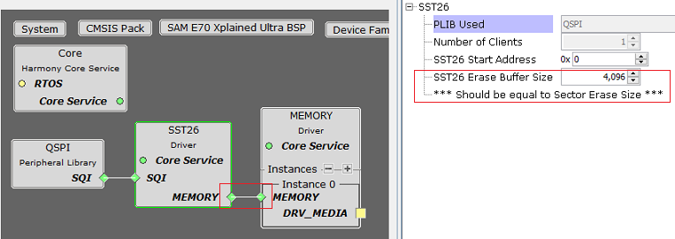

# Configuring The Library

The SST26 driver library should be configured through the MHC. The following figures show the MHC configuration window for the SST26 driver and brief description.

**SST26 Driver with SQI peripheral connected**

**SST26 Driver with QSPI peripheral in SPI mode connected**

**SST26 Driver with QSPI peripheral in SQI mode connected**

**SST26 Driver with connection to Memory Driver**

**Configuration Options**

-   **PLIB Used:**

    -   Specifies the Peripheral library connected

-   **Number Of Clients:**

    -   Indicates maximum number of clients

    -   Always set to one as it supports only a single client

-   **Number Of Buffer Descriptors**

    -   This option appears only when SQI peripheral is connected to the driver

    -   Indicates Maximum number of SQI DMA Buffer Descriptors to be used to create chain of requests for Read

    -   Increase in number of descriptors will allow to read **\(256 \* Number of Descriptors\)** Bytes from flash at one shot

-   **SQI Lane Mode:**

    -   This option appears only when SQI peripheral is connected to the driver

    -   Specifies number of lanes to be used for sending the data on SQI

-   **SQI Chip Select:**

    -   This option appears only when SQI peripheral is connected to the driver

    -   Specifies the Chip select to be used. Should align with Chip select configured in SQI peripheral library settings

-   **Chip Select Pin:**

    -   This option appears only when SPI peripheral or QSPI peripheral in SPI mode is connected to the driver

    -   GPIO Pin to be used as chip select when connected in SPI mode

-   **SST26 Start Address:**

    -   Specifies the flash memory start address to be used for Transfer operations

    -   The start address will be populated in the device geometry table DRV\_SST26\_GEOMETRY

-   **SST26 Erase Buffer Size:**

    -   This option appears only when the SST26 driver is connected to the Memory driver for block operations

    -   Specifies the size for erase buffer used by Memory driver

    -   The size of the buffer should be equal to erase sector size as the memory driver will call DRV\_SST26\_SectorErase

**Parent topic:**[SST26 Driver](GUID-11624F96-C547-408B-81F9-B4FA1C9487D6.md)

