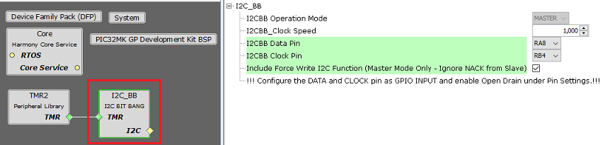
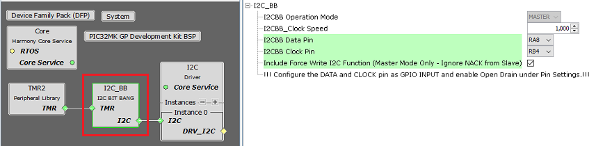

# Configuring The Library

I2C Bit Bang Library should be configured via MHC. The following figures show the MHC configuration window for I2C Bit Bang and brief description.

**I2C Bit Bang Configuration**

**I2C Bit Bang Configuration wih I2C Driver**

**Configuration Options**

-   **I2CBB Operation Mode:**

    -   Indicates the I2C mode used by the library.

    -   The I2C bit bang library only supports master mode.

-   **I2CBB Clock Speed:**

    -   Specifies the I2C clock speed in Hz

-   **I2CBB Data Pin:**

    -   Specifies the GPIO pin number to be configured as I2C Data Line

    -   The specified pin has to be configured as GPIO input and open drain has to be enabled

-   **I2CBB Clock Pin:**

    -   Specifies the GPIO pin number to be configured as I2C Clock Line

    -   The specified pin has to be configured as GPIO input and open drain has to be enabled

-   **Include Force Write I2C Function:**

    -   when enabled generates the I2C force write API which can be used to perform force writes to I2C slave. The generated API ignores any NACK from slave during the write

    -   Used in Master mode only

**Parent topic:**[I2C Bit Bang](GUID-64D5F998-D72C-42CD-902F-D3FED8339A94.md)

