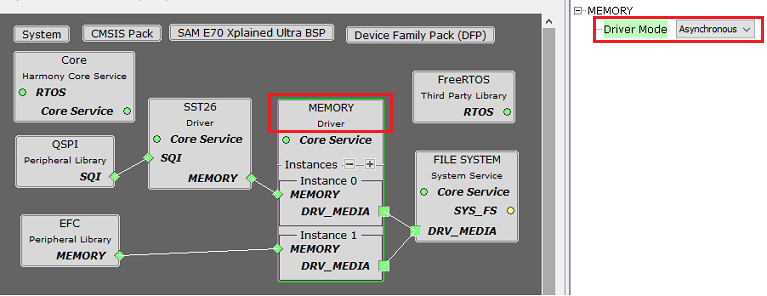
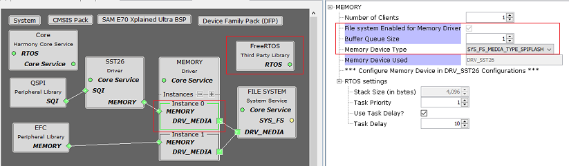
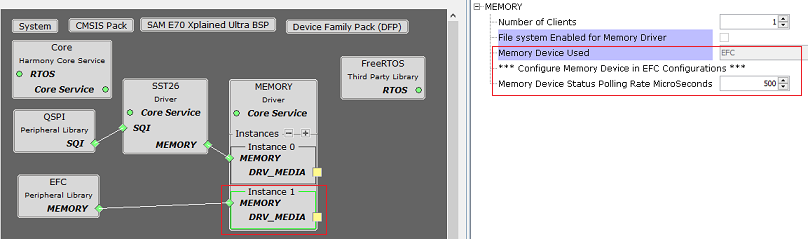

# Configuring The Library

Memory Driver Library should be configured via MHC. The following figures show the MHC configuration window for Memory Driver and brief description.

**Common User Configuration for all Instances**

-   **Driver Mode:**

    -   Allows User to select the mode of driver\(Asynchronous or Synchronous\). This setting is common for all the instances.

**Instance Specific User Configurations**

**Asynchronous Mode with RTOS and File System**

**Synchronous Mode with RTOS and Without File System**

-   **Number Of Clients:**

    -   Specifies number of clients to access the specific instance of the driver

-   **File System Enabled For Memory Driver:**

    -   Specifies if File system service is connected to the instance of Memory Driver

-   **Buffer Queue Size:**

    -   Specifies maximum number of requests to be buffered in queue

    -   This Configuration is displayed only in **Asynchronous mode**

-   **Memory Device Type:**

    -   Specifies the type of the memory device to be used when the File system is connected to this instance

-   **Memory Device Used:**

    -   Specifies the Media device connected

-   **Memory Device Status Polling Rate Microseconds:**

    -   Specifies the interval to poll for the transfer status

    -   Option is displayed only in **Synchronous mode** and when Memory device used does not support interrupt mode

-   **RTOS Settings:**

    -   This configuration is displayed only in asynchronous mode

    -   **Stack Size \(in bytes\):**

        -   Specifies the number of bytes to be allocated on the stack for the Memory driver task of the instance

    -   **Task Priority:**

        -   Specifies priority for the Memory driver task thread. The value can vary based on RTOS used

    -   **Use Task Delay?**

        -   When enabled the Memory driver task will be scheduled out voluntarily after every run based on the delay configured.

        -   **Task Delay:**

            -   Specifies the duration the task has to go to sleep after every run.

            -   Should be configured carefully based on the application need and number of task running along in the system

**RTOS Settings For MicriumOS-III RTOS**

Below additional options are visible in **drivers instance RTOS settings** when the MicriumOS-III is added into project graph

-   **Maximum Message Queue Size:**

    -   This argument specifies the maximum number of messages that the task can receive through internal message queue.

        -   A MicriumOS-III task contains an optional internal message queue \(if OS\_CFG\_TASK\_Q\_EN is set to DEF\_ENABLED in os\_cfg.h\).

    -   The user may specify that the task is unable to receive messages by setting this argument to 0

-   **Task Time Quanta:**

    -   The amount of time \(in clock ticks\) for the time quanta when Round Robin is enabled.

    -   If you specify 0, then the default time quanta will be used which is the tick rate divided by 10.

-   **Task Specific Options:**

    -   Contains task-specific options. Each option consists of one bit. The option is selected when the bit is set.

    -   The current version of MicriumOS-III supports the following options:

        -   **Stack checking is allowed for the task:**

            -   Specifies whether stack checking is allowed for the task

        -   **Stack needs to be cleared:**

            -   Specifies whether the stack needs to be cleared

        -   **Floating-point registers needs to be saved:**

            -   Specifies whether floating-point registers are saved.

            -   This option is only valid if the processor has floating-point hardware and the processor-specific code saves the floating-point registers

        -   **TLS \(Thread Local Storage\) support needed for the task:**

            -   If the caller doesn�t want or need TLS \(Thread Local Storage\) support for the task being created.

            -   If you do not include this option, TLS will be supported by default. TLS support was added in V3.03.00

**Parent topic:**[Memory Driver](GUID-0FFCD458-7F10-49C8-B068-E4E4B5439C47.md)

