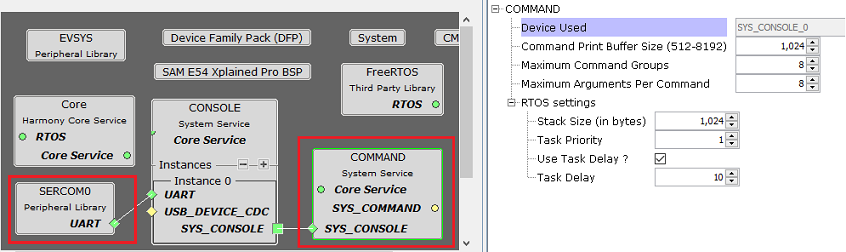
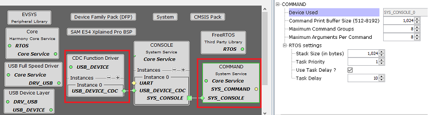

# Configuring The Library

Command System Service Library should be configured via MHC. The following figures show the MHC configuration window for Command System Service and brief description.

The Command Processor is dependent on the services provided by the console system which in turn depends on the UART PLIB or USB CDC function driver.

**Command System Service connected to UART based Console**

**Command System Service connected to USB based Console**

**Configuration Options**

-   **Device Used:**

    -   Indicates the console instance that the Debug System Service will use

-   **Command Print Buffer Size \(512-8192\):**

    -   Indicates the size of the command print buffer in bytes

-   **Maximum Command Groups:**

    -   Specifies the maximum command groups to be used

-   **Maximum Arguments Per Command:**

    -   Specifies the maximum number of arguments per command

-   **RTOS Settings:**

    -   **Stack Size \(in bytes\):**

        -   Specifies the number of bytes to be allocated on the stack for the System Command task

    -   **Task Priority:**

        -   Specifies priority for the System Commandtask thread. The value can vary based on RTOS used

    -   **Use Task Delay?**

        -   When enabled the System Command task will be scheduled out voluntarily after every run based on the delay configured.

        -   **Task Delay \(ms\):**

            -   Indicates the amount of time for which the System Command RTOS thread is put in blocked state by the scheduler before it is run again

**RTOS Settings For MicriumOS-III RTOS**

Below additional options are visible in **system commands RTOS settings** when the MicriumOS-III is added into project graph

-   **Maximum Message Queue Size:**

    -   This argument specifies the maximum number of messages that the task can receive through internal message queue.

        -   A MicriumOS-III task contains an optional internal message queue \(if OS\_CFG\_TASK\_Q\_EN is set to DEF\_ENABLED in os\_cfg.h\).

    -   The user may specify that the task is unable to receive messages by setting this argument to 0

-   **Task Time Quanta:**

    -   The amount of time \(in clock ticks\) for the time quanta when Round Robin is enabled.

    -   If you specify 0, then the default time quanta will be used which is the tick rate divided by 10.

-   **Task Specific Options:**

    -   Contains task-specific options. Each option consists of one bit. The option is selected when the bit is set.

    -   The current version of MicriumOS-III supports the following options:

        -   **Stack checking is allowed for the task:**

            -   Specifies whether stack checking is allowed for the task

        -   **Stack needs to be cleared:**

            -   Specifies whether the stack needs to be cleared

        -   **Floating-point registers needs to be saved:**

            -   Specifies whether floating-point registers are saved.

            -   This option is only valid if the processor has floating-point hardware and the processor-specific code saves the floating-point registers

        -   **TLS \(Thread Local Storage\) support needed for the task:**

            -   If the caller doesn�t want or need TLS \(Thread Local Storage\) support for the task being created.

            -   If you do not include this option, TLS will be supported by default. TLS support was added in V3.03.00

**Parent topic:**[Command Processor System Service](GUID-09F65940-7D05-4F78-81C9-6356B65DEF21.md)

