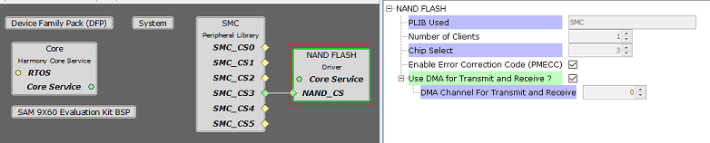

# Configuring The Library

The NAND Flash driver library should be configured through the MHC. The following figures show the MHC configuration window for the NAND Flash driver and brief description.

**NAND Flash Driver with SMC peripheral connected**

**Configuration Options**

-   **PLIB Used:**

    -   Specifies the Peripheral library connected

-   **Number Of Clients:**

    -   Indicates maximum number of clients

    -   Always set to one as it supports only a single client

-   **Chip Select:**

    -   NAND Flash chip select - NAND Flash Controller support available in this chip select number

-   **Enable Error Correction Code \(PMECC\):**

    -   Provides hardware accelerated error correction code using PMECC and PMERRLOC

        -   The Programmable Multibit Error Correction Code Controller \(PMECC\) can be used to generate redundancy information for NAND Flash devices. It supports redundancy for correction of 2, 4, 8, 12 or 24 bits of error per sector of data

        -   Programmable Multibit ECC Error Location Controller \(PMERRLOC\) provides Hardware Acceleration to Determine Roots of Polynomials Defined over a Finite Field

-   **Use DMA for Transmit and Receive ?**

    -   If this option is enabled then NAND Flash driver uses DMA for page/block read and write operations from/to the NAND Flash device.

**Parent topic:**[NAND Flash Driver](GUID-BFFB8AD8-CD11-49AB-8C23-F860A883EFE6.md)

