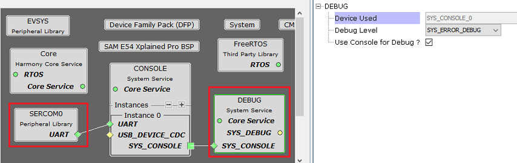
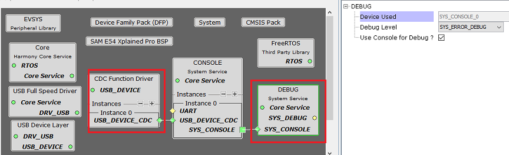

# Configuring The Library

Debug System Service Library should be configured via MHC. The following figures show the MHC configuration window for Debug System Service and brief description.

The Debug System uses the services provided by the Console System Service which in turn depends on the UART peripheral library or USB CDC device.

**Debug System Service connected to UART based Console**

**Debug System Service connected to USB based Console**

**Configuration Options**

-   **Device Used:**

    -   Indicates the console instance that the Debug System Service will use.

-   **Debug Level:**

    -   Indicates the global error level set during initialization. Application can change the global error level during runtime using an API.

-   **Use Console for Debug ?:**

    -   Check this option to map the debug macros to debug implementation. Un-checking this option maps the debug macros to nothing.

**Parent topic:**[Debug System Service](GUID-4F625306-2206-49B1-8846-60C97E40A440.md)

