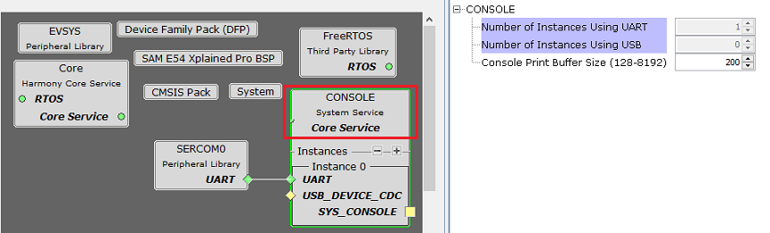
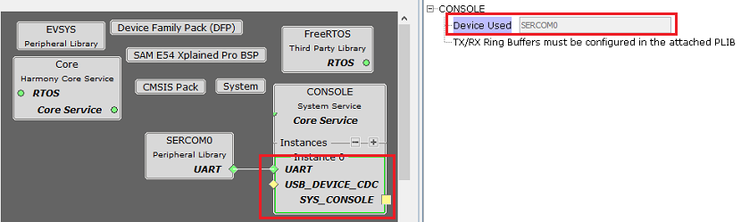
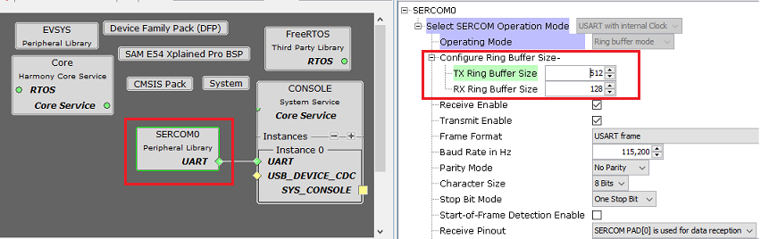
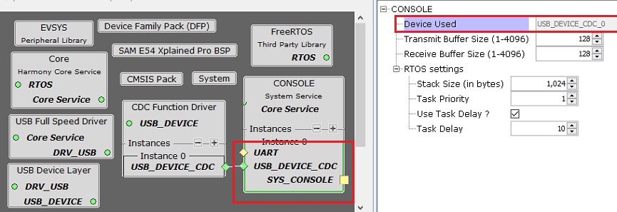

# Configuring The Library

Console System Service Library should be configured via MHC. The following figures show the MHC configuration window for Console System Service and brief description.

**Common User Configuration for all Instances**

-   **Number of Instances Using UART:**

    -   Specifies the number of console instances using UART

-   **Number of Instances Using USB:**

    -   Specifies the number of console instances using USB CDC

-   **Console Print Buffer Size \(128-8192\):**

    -   Specifies the Print buffer size for console system service in bytes

**UART Console**

The following figure shows the MHC configuration window for configuring the UART Console Device and a brief description of various configuration options.

The console system service requires the connected UART peripheral library to be configured in the interrupt mode.

**Console System Service Instance configurations with SERCOM UART PLIB**

**SERCOM UART PLIB configurations with Console System Service**

**Configuration Options**

-   **Device Used:**

    -   Indicates the hardware UART Peripheral Library instance used by the Console System Service.

    -   The underlying USART/SERCOM/FLEXCOM PLIB must be configured in interrupt mode.

    -   **Note:**

        -   The TX/RX ring buffers must be configured in the attached PLIB as shown above.

        -   In the above example, the TX and RX ring buffer sizes are configured in the attached SERCOM3 PLIB.

**USB Console:**

The following figure shows the MHC configuration window for configuring the USB Console Device and a brief description of various configuration options.

**Console System Service Instance configurations with USB CDC Driver**

**Configuration Options**

-   **Device Used:**

    -   Indicates the USB CDC Instance used by the Console System Service.

-   Transmit Buffer Size \(1-4096\): Size of the transmit ring buffer

-   Receive Buffer Size \(1-4096\): Size of the receive ring buffer

-   **RTOS Settings:**

    -   **Stack Size \(in bytes\):**

        -   Specifies the number of bytes to be allocated on the stack for the System Console task of the instance

    -   **Task Priority:**

        -   Specifies priority for the System Console task thread. The value can vary based on RTOS used

    -   **Use Task Delay?**

        -   When enabled the System Console task will be scheduled out voluntarily after every run based on the delay configured.

        -   **Task Delay \(ms\):**

            -   Indicates the amount of time for which the System Console RTOS thread is put in blocked state by the scheduler before it is run again

**RTOS Settings For MicriumOS-III RTOS**

Below additional options are visible in **system console instance RTOS settings** when the MicriumOS-III is added into project graph

-   **Maximum Message Queue Size:**

    -   This argument specifies the maximum number of messages that the task can receive through internal message queue.

        -   A MicriumOS-III task contains an optional internal message queue \(if OS\_CFG\_TASK\_Q\_EN is set to DEF\_ENABLED in os\_cfg.h\).

    -   The user may specify that the task is unable to receive messages by setting this argument to 0

-   **Task Time Quanta:**

    -   The amount of time \(in clock ticks\) for the time quanta when Round Robin is enabled.

    -   If you specify 0, then the default time quanta will be used which is the tick rate divided by 10.

-   **Task Specific Options:**

    -   Contains task-specific options. Each option consists of one bit. The option is selected when the bit is set.

    -   The current version of MicriumOS-III supports the following options:

        -   **Stack checking is allowed for the task:**

            -   Specifies whether stack checking is allowed for the task

        -   **Stack needs to be cleared:**

            -   Specifies whether the stack needs to be cleared

        -   **Floating-point registers needs to be saved:**

            -   Specifies whether floating-point registers are saved.

            -   This option is only valid if the processor has floating-point hardware and the processor-specific code saves the floating-point registers

        -   **TLS \(Thread Local Storage\) support needed for the task:**

            -   If the caller doesn�t want or need TLS \(Thread Local Storage\) support for the task being created.

            -   If you do not include this option, TLS will be supported by default. TLS support was added in V3.03.00

**Parent topic:**[Console System Service](GUID-C8EFF72A-1BBB-416E-BF89-EEA2B23EB27D.md)

