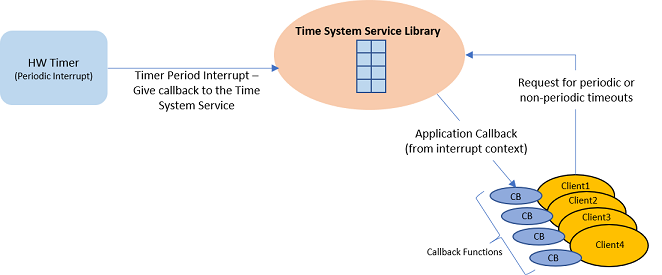

# How the Library Works

The tick-less implementation reduces the overheads of servicing the unneeded hardware timer interrupt on every tick. The tick-less implementation can also provide higher resolution compared to a tick based implementation, as there is no fixed tick rate.

**Abstraction Model**

The Time System Service library provides an abstraction to the hardware timer to provide following functionalities.

-   Periodic Callback

-   One Shot/Single Callback

-   Delays

The following diagram depicts the Time System Service abstraction model.

**Time System Service configured in tick-less mode**

**Time System Service configured in tick-based mode**

**Execution Flow**

-   The Time System Service registers a callback with the underlying hardware timer peripheral library

-   Depending on the alarm/delay time periods requested by various clients, the implementation manages the hardware timer such that a compare interrupt is generated only when needed and at appropriate times

    -   This is achieved by maintaining a sorted list of timing requested by different clients such that the head of the list always indicates the time after which the hardware timer must interrupt and notify the Timer System Service

-   Inside the Time System Service callback, the list is updated and a callback is given to the client for which the alarm/delay has expired

The following diagram shows how the tick-less implementation reduces the number of hardware interrupts. In this example, two clients - Client A and Client B requests a periodic alarm every 30 ms and 70 ms respectively.

**Parent topic:**[Time System Service](GUID-05D0B89A-EE4D-46D4-B58F-7402C56061AE.md)

