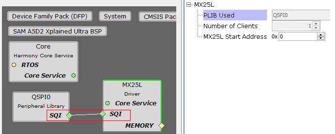
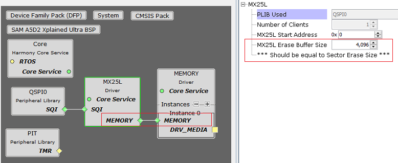

# Configuring The Library

The MX25L driver library should be configured through the MHC. The following figures show the MHC configuration window for the MX25L driver and brief description.

**MX25L Driver with QSPI peripheral in SQI mode connected**

**MX25L Driver with connection to Memory Driver**

**Configuration Options**

-   **PLIB Used:**

    -   Specifies the Peripheral library connected

-   **Number Of Clients:**

    -   Indicates maximum number of clients

    -   Always set to one as it supports only a single client

-   **MX25L Start Address:**

    -   Specifies the flash memory start address to be used for Transfer operations

    -   The start address will be populated in the device geometry table DRV\_MX25L\_GEOMETRY

-   **MX25L Erase Buffer Size:**

    -   This option appears only when the MX25L driver is connected to the Memory driver for block operations

    -   Specifies the size for erase buffer used by Memory driver

    -   The size of the buffer should be equal to erase sector size as the memory driver will call DRV\_MX25L\_SectorErase

**Parent topic:**[MX25L Driver](GUID-276B2413-47FF-4F2A-8221-2808537B02CE.md)

