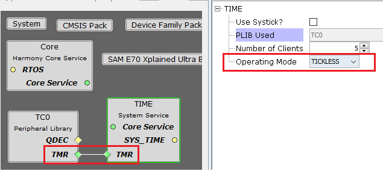
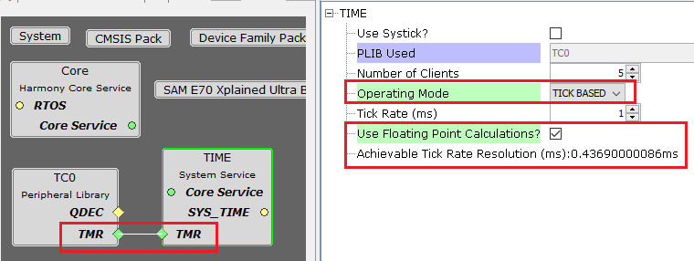
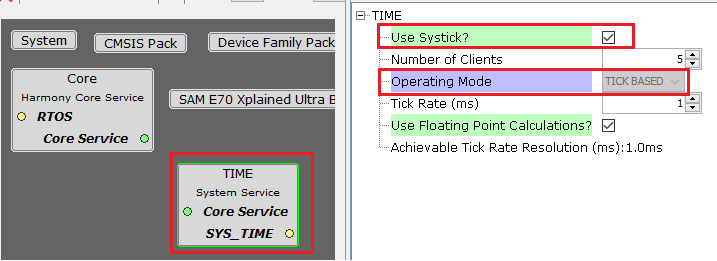
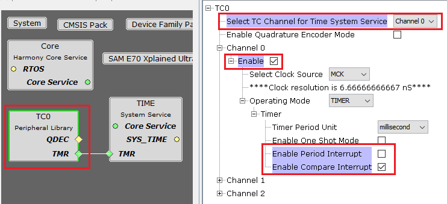
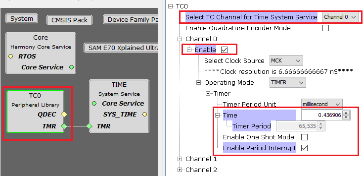

# Configuring The Library

The Time System Service library should be configured through the MHC. The following figure shows the MHC configuration window for configuring the Time System Service and a brief description of various configuration options.

Depending on the timer PLIB connected to the Time System Service, the Time System Service provides options to setup the Time System Service in either Tick-less mode or Tick-based mode.

-   The Time System Service shows both Tick-less and Tick-based options for the timers that support for both compare and period modes.

-   The Time System Service shows only Tick-less mode for timers that only support compare mode.

-   The Time System Service shows only Tick-based mode for timers that support only period mode.

-   The Time System Service shows only Tick-based mode for Systick

**Time System Service Connected to TMR Peripheral \(TC0\) and configured in Tick-less mode**

**Time System Service Connected to TMR Peripheral \(TC0\) and configured in Tick-based mode**

**Time System Service using Systick**

**Time System Service Configuration Options**

-   **Use Systick?**

    -   This option is visible only in Bare-Metal environment

    -   When Enabled Time system service use the Systick peripheral

    -   Operating mode is fixed to TICK BASED

-   **PLIB Used:**

    -   This option is visible only when a Timer peripheral library is connected

    -   Indicates the hardware Timer Peripheral Library instance used by the Time System Service

-   **Number of Clients:**

    -   Indicates the maximum number of alarm/delay requests that can be active at any given time.

-   **Operating Mode:**

    -   Indicates the operating mode used

        -   If a timer PLIB is connected to it can be TICK BASED or/and TICKLESS mode

        -   If Systick is used then it is configured to TICK BASED mode

-   **Tick Rate \(ms\):**

    -   This option is supported only in TICK BASED Operating mode

    -   Indicates the tick rate when the Time System Service is configured in TICK BASED mode

-   **Use Floating Point Calculations?**

    -   This option is supported only in TICK BASED Operating mode

    -   When Enabled Time system service uses floating point calculations

**TC0 Peripheral Configuration Options**

The hardware Timer Peripheral library is automatically configured for the correct mode of operation when it is connected to the Time System Service as shown in the below example snapshots for TC instance 0.

**Timer PLIB TC0 automatically configured by Time System Service when configured for tick-less mode**

**Timer PLIB TC0 automatically configured by Time System Service when configured for tick-based mode**

**Parent topic:**[Time System Service](GUID-05D0B89A-EE4D-46D4-B58F-7402C56061AE.md)

