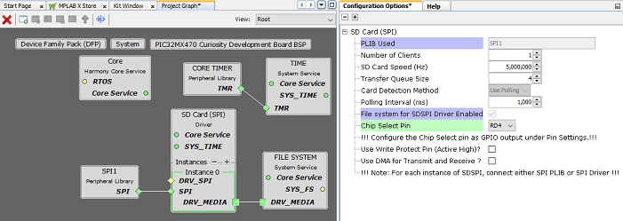
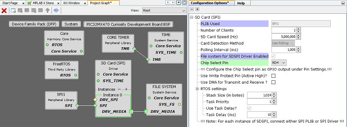
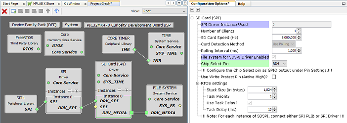

# Configuring The Library

SDSPI Driver Library should be configured via MHC. The following figures show the MHC configuration window for SDSPI driver and brief description.

**Common User Configuration for all Instances**

-   **Driver Mode:**

    -   Allows User to select the mode of driver\(Asynchronous or Synchronous\). This setting is common for all the instances.

    -   When the SDSPI driver is used with SPI driver, the SPI driver inherits the driver mode from the SDSPI driver. That is, if the SDSPI driver is configured for Asynchronous mode then the SPI driver is automatically configured for Asynchronous mode and vice-versa.

**Instance Specific User Configurations**

**Asynchronous Mode with SPI PLIB and File-System**

**Asynchronous Mode with SPI Driver and File-System**

**Synchronous Mode with SPI PLIB, RTOS and File-System**

**Synchronous Mode with SPI Driver, RTOS and File-System**

-   **PLIB Used:**

    -   This option is displayed only when SDSPI driver is connected to SPI PLIB

    -   Indicates the SPI peripheral instance used by the SDSPI driver

-   **SPI Driver Instance Used:**

    -   This option is displayed only when SDSPI driver is connected to SPI Driver

    -   Indicates the SPI driver instance used by the SDSPI driver

-   **Number of Clients:**

    -   Specifies number of clients that can access the specific instance of the driver

-   **SD Card Speed \(Hz\):**

    -   The maximum SPI speed at which the SDSPI driver interacts with the SD Card

    -   SDSPI driver overrides the SPI PLIB clock speed settings

-   **Transfer Queue Size:**

    -   Specifies maximum number of requests that can be queued

    -   This Configuration is displayed only in **Asynchronous mode**

-   **Card Detection Method:**

    -   Card detection method used. For SDSPI driver command-response based polling method is used for card insertion/removal

-   **Polling Interval \(ms\):**

    -   Rate at which the SDSPI driver checks for card insertion and removal

-   **File system for SDSPI Driver Enabled:**

    -   Indicates whether SDSPI driver will register its services with the file system or not.

    -   This option is automatically checked when the file system is connected to the SDSPI driver.

-   **Chip Select Pin:**

    -   The SD Card chip select pin

-   **Use Write Protect Pin \(Active High\)?**

    -   Enable write protection check

    -   **Write Protect Pin \(Active High\):**

        -   The selected write protect pin must be configured as GPIO input under the Pin Settings window

-   **Use DMA for Transmit and Receive?:**

    -   Enable/disable DMA usage by the SDSPI driver. This option is available only when SDSPI driver is used with SPI PLIB.

    -   When SDSPI is used with SPI driver, the DMA must be configured in the SPI driver configuration.

    -   **DMA Channel For Transmit:**

        -   Indicates the DMA channel the SDSPI driver will use for transmission

    -   **DMA Channel For Receive:**

        -   Indicates the DMA channel the SDSPI driver will use for reception

-   **RTOS Settings:**

    -   **Stack Size \(in bytes\):**

        -   Specifies the number of bytes to be allocated on the stack for the SDSPI driver task of the instance

    -   **Task Priority:**

        -   Specifies priority for the SDSPI driver task thread. The value can vary based on RTOS used

    -   **Use Task Delay?**

        -   When enabled the SDSPI driver task will be scheduled out voluntarily after every run based on the delay configured.

        -   **Task Delay \(ms\):**

            -   Indicates the amount of time for which the SDSPI RTOS thread is put in blocked state by the scheduler before it is run again

            -   This inturn controls the rate at which the SDSPI driver checks for the SD Card attach/detach status

**RTOS Settings For MicriumOS-III RTOS**

Below additional options are visible in **drivers instance RTOS settings** when the MicriumOS-III is added into project graph

-   **Maximum Message Queue Size:**

    -   This argument specifies the maximum number of messages that the task can receive through internal message queue.

        -   A MicriumOS-III task contains an optional internal message queue \(if OS\_CFG\_TASK\_Q\_EN is set to DEF\_ENABLED in os\_cfg.h\).

    -   The user may specify that the task is unable to receive messages by setting this argument to 0

-   **Task Time Quanta:**

    -   The amount of time \(in clock ticks\) for the time quanta when Round Robin is enabled.

    -   If you specify 0, then the default time quanta will be used which is the tick rate divided by 10.

-   **Task Specific Options:**

    -   Contains task-specific options. Each option consists of one bit. The option is selected when the bit is set.

    -   The current version of MicriumOS-III supports the following options:

        -   **Stack checking is allowed for the task:**

            -   Specifies whether stack checking is allowed for the task

        -   **Stack needs to be cleared:**

            -   Specifies whether the stack needs to be cleared

        -   **Floating-point registers needs to be saved:**

            -   Specifies whether floating-point registers are saved.

            -   This option is only valid if the processor has floating-point hardware and the processor-specific code saves the floating-point registers

        -   **TLS \(Thread Local Storage\) support needed for the task:**

            -   If the caller doesn�t want or need TLS \(Thread Local Storage\) support for the task being created.

            -   If you do not include this option, TLS will be supported by default. TLS support was added in V3.03.00

**Parent topic:**[SDSPI Driver](GUID-89A8332D-B4D0-4989-8602-EACDE3EE74AC.md)

