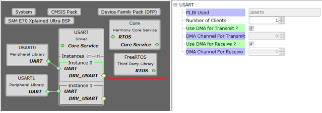

# Configuring The Library

USART Driver Library should be configured via MHC. The following figures show the MHC configuration window for USART driver and brief description.

**Common User Configuration for all Instances**

-   **Driver Mode:**

    -   Allows User to select the mode of driver\(Asynchronous or Synchronous\). This setting is common for all the instances.

**Instance Specific User Configurations**

**USART Driver Configuration in Asynchronous Mode**

**USART Driver Configuration in Synchronous Mode**

-   **PLIB Used:**

    -   Indicates the underlying USART/UART PLIB used by the driver.

-   **Number Of Clients:**

    -   The total number of clients that can open the given USART driver instance

-   **Transfer Queue Size:**

    -   Indicates the size of the transmit/receive queue for the given USART/UART driver instance.

    -   Available only in Asynchronous mode of Operations

-   **Use DMA for Transmit?**

    -   Enables DMA For transmitting the data

    -   **DMA Channel For Transmit:**

        -   DMA Channel for transmission is automatically allocated in DMA configurations

-   **Use DMA for Receive?**

    -   Enables DMA For Receiving the data

    -   **DMA Channel For Receive:**

        -   DMA Channel for Receiving is automatically allocated in DMA configurations

**Parent topic:**[USART Driver](GUID-3DC66955-0F7E-4747-9790-893CA81987A6.md)

