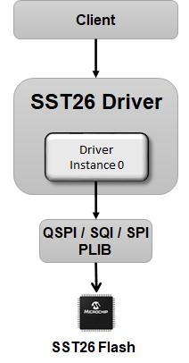

# How the Library Works

The sst26 driver library is a single-client, single-instance based driver interface.

**Abstraction Model**

The SST26 driver interface provides read, write and Erase functions that abstract out the internal workings of the SST26 driver and the underlying QSPI/SQI/SPI protocol.

The client can be:

-   Application - Directly access the SST26 Flash using the APIs provided by the SST26 Driver library

-   Memory Driver - Application can run a file system on the SST26 Flash by connecting it to the Memory Driver which can further be connected to the File System Service

**Working flow**

-   The SST26 Driver performs initialization and puts the driver to ready state. This status of the driver can be checked using **DRV\_SST26\_Status\(\)**

-   The SST26 driver library performs set of flash operations during **DRV\_SST26\_Open\(\)**. If any of the below flash operations fails, an invalid Handle will be returned. DRV\_SST26\_Open\(\) can be repeatedly called until it returns a valid handle.

    -   Resets the Flash

    -   Configures the flash device to QUAD IO Mode if underlying peripheral library is running in QSPI/SQI mode

    -   Unlocks the flash if it has been opened in write mode

-   When the client requests for device geometry, it queries for the JEDEC-Id and populates the geometry table DRV\_SST26\_GEOMETRY appropriately.

-   The driver does not support queuing of more than one requests. The application must check and ensure that any previous request is completed before submitting a new one. This can be done by polling the status of data transfer using **DRV\_SST26\_TransferStatusGet\(\)**

**Parent topic:**[SST26 Driver](GUID-11624F96-C547-408B-81F9-B4FA1C9487D6.md)

