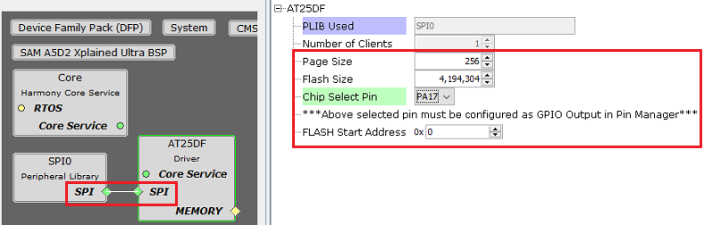
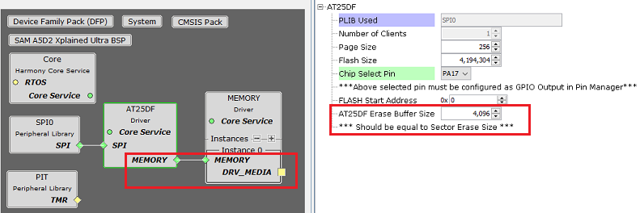

# Configuring The Library

The AT25DF driver library should be configured through the MHC. The following figures show the MHC configuration window for the AT25DF driver and brief description.

**AT25DF Driver with SPI peripheral connected**

**AT25DF Driver with connection to Memory Driver**

**Configuration Options**

-   **PLIB Used:**

    -   Specifies the Peripheral library connected

-   **Number Of Clients:**

    -   Indicates maximum number of clients

    -   Always set to one as it supports only a single client

-   **Page Size:**

    -   Size of one page of FLASH memory \(in bytes\)

-   **Flash Size:**

    -   Total Size of the FLASH memory \(in bytes\)

-   **Chip Select Pin:**

    -   FLASH chip select pin \(active low\)

    -   This pin must be configured as GPIO output in "Pin Settings" configuration

-   **AT25DF Flash Start Address:**

    -   Specifies the flash memory start address to be used for Transfer operations

    -   The start address will be populated in the device geometry table DRV\_AT25DF\_GEOMETRY

-   **AT25DF Erase Buffer Size:**

    -   This option appears only when the AT25DF driver is connected to the Memory driver for block operations

    -   Specifies the size for erase buffer used by Memory driver

    -   The size of the buffer should be equal to erase sector size as the memory driver will call DRV\_AT25DF\_SectorErase

**Parent topic:**[AT25DF Driver](GUID-474B546B-7629-40E2-AF5A-F6A6146CE8DE.md)

